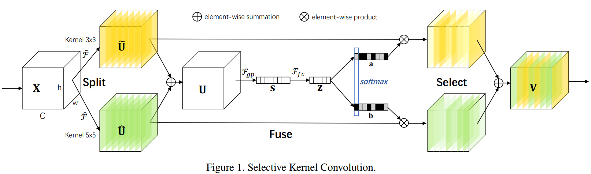

# SKNet-Pytorch
Nearly Perfect &amp; Easily Understandable Implementation of [SKNET(Selective Kernel Networks)](https://arxiv.org/abs/1903.06586) by PyTorch

I reimplemented SKNET using PyTorch. Although there are some implementations of SKNET using Pytorch, some implementations are different from original implementation descripted in the paper, and I was hard to understand their implementations, so I reimplemented SKNET.

## Seletive Kernel Convolution

# Reference
- Paper: [Selective Kernel Networks](https://arxiv.org/abs/1903.06586)
- Paper: [Aggregated Residual Transformations for Deep Neural Networks](https://arxiv.org/abs/1611.05431)
- Repository: [pppLang/SKNet](https://github.com/pppLang/SKNet)
- Repository: [ResearchingDexter/SKNet_pytorch](https://github.com/ResearchingDexter/SKNet_pytorch)
- Repository: [bearpaw/pytorch-classification](https://github.com/bearpaw/pytorch-classification/blob/master/models/imagenet/resnext.py)

